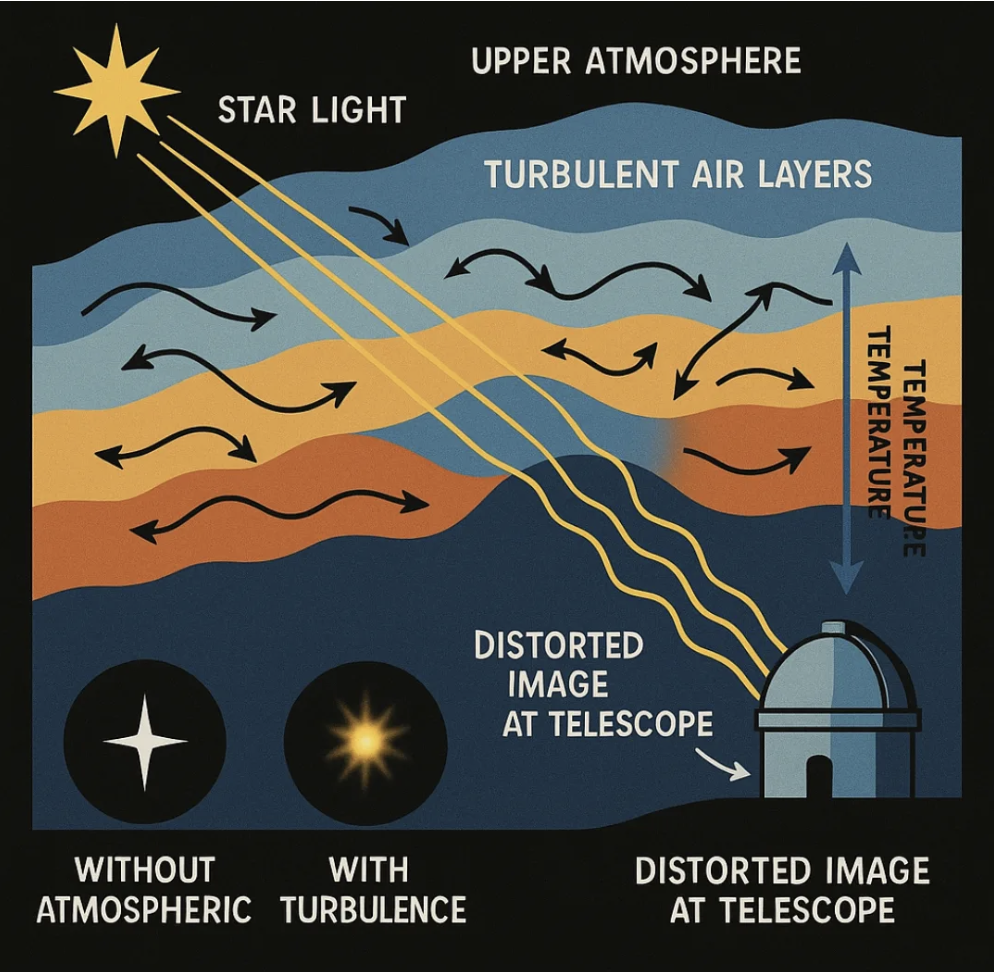

 ## OVERVIEW + SUMMARY
 
 ### What is optical turbulence?

 When light from astronomical objects travels through Earth’s atmosphere, it passes through layers of air with varying temperature, density, and wind velocity. These fluctuations cause the air’s **refractive index** to change randomly in space and time.

 This phenomenon is known as **optical turbulence**, and it is the primary reason stars appear to “twinkle” from the ground.

 ### What is “Seeing”?

 In astronomy, **seeing** refers to the blurring and distortion of astronomical images caused by atmospheric turbulence. Good seeing corresponds to stable atmospheric conditions and sharper images, while poor seeing results in blurred and unstable observations.

 Seeing is typically quantified as the **full width at half maximum (FWHM)** of a star’s point spread function (PSF), measured in arcseconds.

 ### How We Measure Seeing and Turbulence?

 This project combines multiple complementary instruments:

 #### - DIMM (Differential Image Motion Monitor)
 Measures atmospheric seeing by tracking the relative motion of star images formed through separate apertures. It provides a direct estimate of image distortion caused by turbulence.

 #### - MASS (Multi-Aperture Scintillation Sensor)
 Measures turbulence strength as a function of altitude by analyzing scintillation (intensity fluctuations) of starlight. This enables reconstruction of vertical turbulence profiles in the upper atmosphere.

 #### - CFHT (Canada–France–Hawaii Telescope)
 Provides high-quality astronomical observations used both for validation and for studying the impact of atmospheric conditions on real science data.

 ---

 ## Project Goals

 This pipeline implements an end-to-end framework for:

 1. Cleaning and harmonizing multi-instrument observational data
 2. Aligning DIMM, MASS, and CFHT datasets across time
 3. Characterizing statistical properties of atmospheric turbulence
 4. Decomposing turbulence into vertical atmospheric layers
 5. Analyzing long-term trends (2009–present)
 6. Developing predictive models for future seeing conditions
 7. Evaluating how turbulence impacts observational astronomy quality
 <br>

 ## Example: Atmospheric Seeing

 
 Image from: https://astroimagery.com/astronomy/what-does-seeing-mean-in-astrophotography/
 <br>
 <br>

 ## Methodology and Data Pipeline
 
 ### 1. make_csv_files.ipynb  
 ---
 
 Main data engineering pipeline that constructs the master dataset.

 FUNCTION: **`make_csv_files(year: string)`**
 
 Takes a year in "YYYY" format (string) and generates daily datasets.
 
 #### WORKFLOW
 
 1. Load CFHT yearly weather data
 2. Iterate over all dates in year
 3. Load DIMM + MASS daily data from URLs
 
 #### Time alignment:

 * Match DIMM ↔ MASS (nearest timestamp, tolerance ~900s)
 * Match result ↔ CFHT (nearest timestamp)

 #### FEATURES

 DIMM:
 * dimm_val

 MASS layers:
 * mass_val
 * 500m
 * 1km
 * 2km
 * 4km
 * 8km
 * 16km
 
 CFHT:
 * wind_speed (m/s)
 * wind_direction (°)
 * temperature (°C)
 * humidity (%)
 * pressure (Pa)
 
 Time differences:
 * dimm_mass_dt (s)
 * dimm_cfht_dt (s)
 
 Derived:
 * ground_layer turbulence (Kolmogorov)
 
 #### OUTPUT
 
 * {date}_result.csv
 <br>

 ### 2. convertCSVToFits.ipynb
 ---

 Converts merged CSV dataset into FITS format.
 
 #### WORKFLOW:
 * Load daily CSV files
 * Merge into master dataset
 * Convert to FITS for faster I/O
 
 #### OUTPUT:
 * master.fits
 <br>

 ### 3. mass_file_to_csv.ipynb
 ---
 
 Converts raw MASS .mass files into CSV format.
 
 
 #### LINUX DATA DOWNLOAD
 

 Example (using 2018):
 ```
 curl -s https://www.cfht.hawaii.edu/ObsInfo/Weather/mkam/MASSdata/out/ \
 | grep -o '18[^"]*\.mass\.bz2' \
 | while read f; do
     curl -O "https://www.cfht.hawaii.edu/ObsInfo/Weather/mkam/MASSdata/out/$f"
   done
 
 cat 18*.mass.bz2 > ../2018_floating.mass.bz2
 ```
 
 #### PROCESSING
 
 Convert .mass → CSV
 Convert timestamps:
 UTC → HST
 <br>

 FUNCTION: **`read_mass_file(filename)`**
 <br>

 Extracts:
 * floating layer: heights + strengths
 * fixed layer: heights + strengths
 * grouped by timestamp
 <br>

 ### 4. plot_functions.ipynb
 ---
 
 Shared visualization utility library.
 
 FUNCTIONS:
 
 * **`doanes_rule_bins`**
 * **`cdf_even_odd`**
 * **`cdf_comparison`**
 * **`doane_hist`**
 * **`plot_median_per_bin_doane`**
 * **`month_year_boxplot`**
 
 PURPOSE:
 * Standardized statistical plotting
 * CDF comparisons
 * Doane binning
 * Seasonal/yearly analysis
 * Median-per-bin trends
 <br>

 ### 5. VISUALIZATION NOTEBOOKS
 ---

 i. **`box_plots.ipynb`**<br>
 &nbsp;&nbsp;&nbsp;&nbsp;→ month/year boxplots
 <br>

 ii. **`CDFs.ipynb`**<br>
 &nbsp;&nbsp;&nbsp;&nbsp;→ even/odd comparisons<br>
 &nbsp;&nbsp;&nbsp;&nbsp;→ first/second half comparisons
 <br>

 iii. **`CFHT_histograms.ipynb`**<br>
 &nbsp;&nbsp;&nbsp;&nbsp;→ histogram + CDF analysis using Doane rule
 <br>

 iv. **`comparison_graphs.ipynb`**<br>
 &nbsp;&nbsp;&nbsp;&nbsp;→ fixed vs floating density plots<br>
 &nbsp;&nbsp;&nbsp;&nbsp;→ KDE-based comparisons
 <br>

 v. **`correlation_matrix.ipynb`**<br>
 &nbsp;&nbsp;&nbsp;&nbsp;→ correlation between MASS layers, DIMM, CFHT<br>
 &nbsp;&nbsp;&nbsp;&nbsp;→ identifies unexpected correlations
 <br>

 vi. **`floating_layer_plots.ipynb`**<br>
 &nbsp;&nbsp;&nbsp;&nbsp;→ MASS floating layer processing
 <br>

 vii. **`histogram_choice.ipynb`**<br>
 &nbsp;&nbsp;&nbsp;&nbsp;→ compares Sturges, Rice, Doane<br>
 &nbsp;&nbsp;&nbsp;&nbsp;→ selects Doane’s rule
 <br>

 viii. **`layer_strengths.ipynb`**<br>
 &nbsp;&nbsp;&nbsp;&nbsp;→ histogram + CDF per MASS layer<br>
 &nbsp;&nbsp;&nbsp;&nbsp;→ 500m → 16km<br>
 &nbsp;&nbsp;&nbsp;&nbsp;→ stats: mean, median, mode, std
 <br>

 ix. **`median_per_bin_plots.ipynb`**<br>
 &nbsp;&nbsp;&nbsp;&nbsp;→ median-per-bin using Doane bins<br>
 &nbsp;&nbsp;&nbsp;&nbsp;→ trend extraction<br>
 <br>

 ### 6. forecast_model.ipynb
 ---
 
 LSTM forecasting model trained on full dataset.
 
 #### PURPOSE:
 Predict next-day atmospheric conditions
 
 #### INPUT:
 30+ parameters across multiple years
 
 #### PIPELINE:
 * preprocessing
 * scaling
 * sequence building
 * LSTM training
 * prediction
 
 #### CONCEPT:
 "Given past atmospheric behavior, predict tomorrow."
 <br>

 ## SUMMARY
 
 * Raw telescope + atmospheric data<br>
   → cleaned merged dataset<br>
   → statistical analysis<br>
   → visualization suite<br>
   → machine learning forecasting (LSTM)